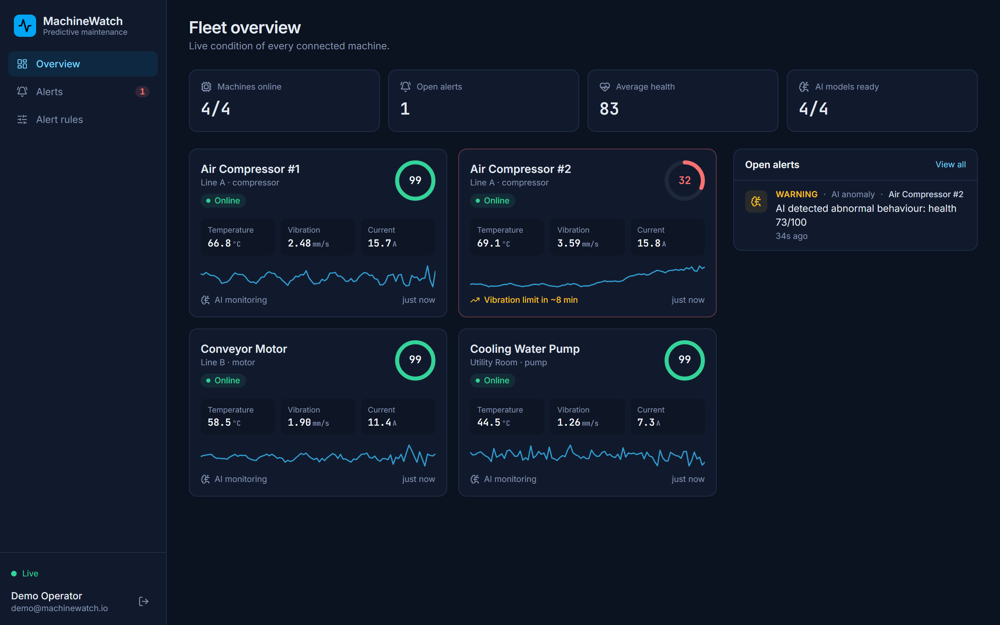
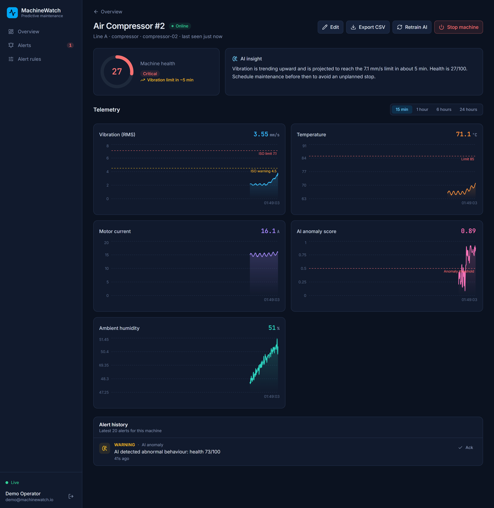
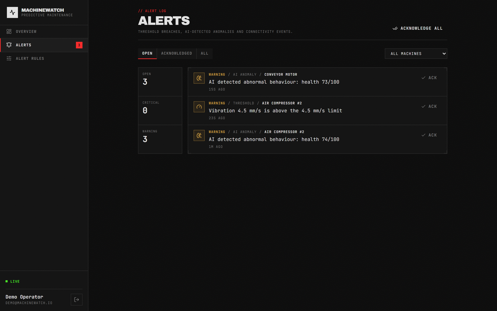
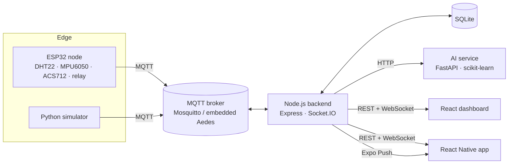

# MachineWatch

**Real-time industrial machine monitoring with AI-based predictive maintenance.**

ESP32 sensor nodes stream temperature, vibration, motor current and humidity over MQTT. A Node.js backend stores
the data, evaluates alert rules and pushes live updates to a 3D-visualized React dashboard and a React Native app.
A Python service learns each machine's normal behaviour, flags anomalies and forecasts when vibration will cross
the ISO 10816 limit, often **before** any fixed threshold is reached.

A public, no-login showcase page (`/showcase`) walks through the same pipeline for visitors and links through to the live demo.



| Machine detail | Alerts |
| --- | --- |
|  |  |

## Features

- **End-to-end IoT pipeline:** ESP32 firmware → MQTT → Node.js → SQLite → WebSocket → web and mobile.
- **Live dashboard:** fleet overview with an interactive 3D factory floor (drag to orbit, click a unit to open it), per-machine charts (15 min to 24 h, auto-downsampled) alongside a live 3D machine model, CSV export.
- **AI anomaly detection:** a per-device Isolation Forest trained on the machine's own baseline, a health score from 0 to 100, and a vibration trend forecast (`limit in ~3.5 h`).
- **Alert engine:** threshold rules with cooldowns, AI anomaly alerts and offline detection (MQTT last will plus a heartbeat timeout).
- **Remote control:** start or stop a machine through a relay, with state confirmed by the device.
- **Mobile app:** fleet status, live metrics, alerts and push notifications for critical events.
- **Device auto-registration:** a node announces its name, location and whether it's a simulator over a retained `meta` topic.
- **Hardware-free demo:** a physics-based simulator with realistic faults (bearing wear, overheating, vibration spikes).
- **Public showcase page:** an animated, no-login marketing page (`/showcase`) that tells the product story for visitors and links through to the live demo.

## Architecture



| Layer | Stack |
| --- | --- |
| Firmware | C++ (Arduino framework), PlatformIO, PubSubClient, ArduinoJson |
| Messaging | MQTT 3.1.1 (Mosquitto in production, Aedes embedded for local development) |
| Backend | Node.js 24, TypeScript, Express 5, Socket.IO, SQLite (`node:sqlite`), JWT |
| AI | Python 3.11, FastAPI, scikit-learn (Isolation Forest), NumPy |
| Web | React 19, TypeScript, Vite, Tailwind CSS 4, Recharts, React Three Fiber / Drei (3D), GSAP + Motion (animation) |
| Mobile | Expo SDK 57, React Native, React Navigation, expo-notifications |
| DevOps | Docker Compose, Nginx, GitHub Actions CI |

## Repository layout

```
backend/     Node.js API: MQTT ingestion, rules, REST, WebSocket, push notifications
ai-service/  FastAPI anomaly detection and health scoring
web/         React operator dashboard (3D-visualized) + public showcase page
mobile/      Expo / React Native app
firmware/    ESP32 PlatformIO project (wiring guide in firmware/README.md)
simulator/   Simulated machine fleet that speaks the same MQTT contract
scripts/     Tooling, e.g. automated screenshot capture, Windows dev-server autostart
```

## Quick start (no Docker)

Requirements: Node.js 24+, Python 3.11+.

```bash
# 1. AI service
python -m venv .venv && .venv/Scripts/activate      # macOS/Linux: source .venv/bin/activate
pip install -r ai-service/requirements-dev.txt -r simulator/requirements.txt
cd ai-service && uvicorn app.main:app --port 8000

# 2. Backend with an embedded MQTT broker (new terminal)
cd backend && npm install
EMBEDDED_BROKER=true npm run dev

# 3. Simulated fleet (new terminal): 5x speed so faults develop within minutes
cd simulator && python simulator.py --interval 0.2 --speed 5

# 4. Dashboard (new terminal)
cd web && npm install && npm run dev
```

Open http://localhost:5173 and sign in with `demo@machinewatch.io` / `demo1234`.

After about a minute every model finishes learning. A little later *Air Compressor #2* starts developing bearing
wear. Watch the AI health score drop and the vibration forecast appear before the 4.5 mm/s warning rule fires.

## Docker

```bash
cp .env.example .env            # set JWT_SECRET
docker compose --profile demo up --build
```

Dashboard: http://localhost:8080. ESP32 nodes on your LAN connect to MQTT on port 1883.

## Connecting a real ESP32

See [firmware/README.md](firmware/README.md) for wiring, configuration and the MQTT contract. In short:

```bash
cd firmware
cp include/secrets.example.h include/secrets.h   # Wi-Fi, broker IP, device name
pio run -t upload && pio device monitor
```

## Mobile app

```bash
cd mobile && npm install
npx expo start
```

In development the app reaches the backend on the computer running Metro (port 4000). For builds, set
`EXPO_PUBLIC_API_URL`. Remote push notifications need a development build and an EAS project id
(`expo.extra.eas.projectId`). In Expo Go the app falls back to local notifications fed by the live socket.

## How the AI works

1. **Baseline:** the first 300 readings per machine (configurable) define its normal operating envelope.
   Features are whichever of temperature, vibration and current that device actually reports — humidity is
   tracked and charted but never scored by the AI model.
2. **Scoring:** an Isolation Forest scores each reading. Scores are normalised so 0 is typical, 0.5 is the learned
   anomaly boundary and 1 is strongly abnormal.
3. **Health:** a combination of the recent anomaly rate and severity, minus a penalty when a limit breach is imminent.
4. **Forecast:** a linear fit over recent vibration projects the time to the 7.1 mm/s ISO 10816 limit. The forecast
   is only shown when the trend is statistically clear (R² ≥ 0.5), so random noise never produces a false countdown.
5. **Alerting:** an AI alert requires most of a batch to be anomalous *and* the smoothed health to have degraded.
   Single spikes do not page anyone.

Models are persisted per device and can be reset from the dashboard ("Retrain AI").

## API overview

| Method | Path | Description |
| --- | --- | --- |
| `POST` | `/api/auth/login` | Obtain a JWT |
| `GET` | `/api/devices` | List machines with status and health |
| `GET` | `/api/devices/:id` | Single machine detail |
| `PATCH` / `DELETE` | `/api/devices/:id` | Rename or relocate, or remove a machine |
| `GET` | `/api/devices/:id/telemetry?from&to&maxPoints` | Readings (bucketed when the range is large) |
| `GET` | `/api/devices/:id/telemetry.csv` | CSV export |
| `POST` | `/api/devices/:id/command` | `{ "relay": false }` |
| `POST` | `/api/devices/:id/retrain` | Reset the AI baseline |
| `GET` | `/api/alerts?state=open\|acknowledged\|all` | Alert feed |
| `POST` | `/api/alerts/:id/ack`, `/api/alerts/ack-all` | Acknowledge |
| `GET` / `POST` / `PATCH` / `DELETE` | `/api/rules` | Threshold rules |
| `POST` / `DELETE` | `/api/push-tokens` / `/api/push-tokens/:token` | Register / unregister an Expo push token |
| `GET` | `/api/health` | Service, MQTT and AI status |

WebSocket events: `telemetry`, `scores`, `device`, `device:removed`, `alert`, `alert:updated`, `alerts:changed`.

## Tests

```bash
cd backend && npm test && npm run typecheck      # ingestion, alert rules, AI integration, HTTP API
cd ai-service && pytest                          # detector, forecasting, persistence, API
cd web && npm run build
cd firmware && pio run
```

All of these run in GitHub Actions on every push.

## License

MIT
