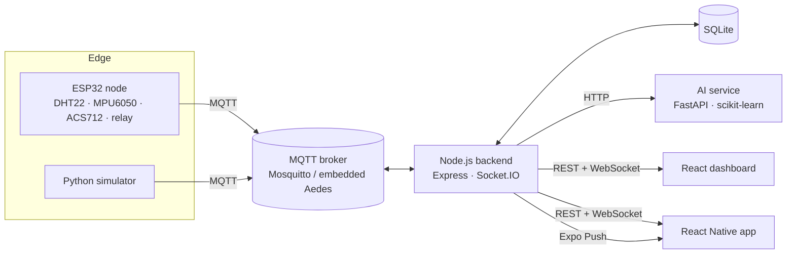

# MachineWatch

[](https://github.com/kazuha11t/machinewatch/actions/workflows/ci.yml)

**Real-time industrial machine monitoring with AI-based predictive maintenance.**

ESP32 sensor nodes stream temperature, vibration, motor current and humidity over MQTT. A Node.js backend stores
the data, evaluates alert rules and pushes live updates to a React dashboard and a React Native app.
A Python service learns each machine's normal behaviour, flags anomalies and forecasts when vibration will cross
the ISO 10816 limit, often **before** any fixed threshold is reached.

A public, no-login showcase page (`/showcase`) walks through the same pipeline for visitors and links through to the live demo.


| Machine detail | Alerts |
| --- | --- |
|  |  |

## Features

- **End-to-end IoT pipeline:** ESP32 firmware → MQTT → Node.js → SQLite → WebSocket → web and mobile.
- **Live dashboard:** fleet overview, per-machine charts (15 min to 24 h, auto-downsampled) alongside a live 3D machine model, CSV export.
- **AI anomaly detection:** a per-device Isolation Forest trained on the machine's own baseline, a health score from 0 to 100, and a vibration trend forecast (`limit in ~3.5 h`).
- **Alert engine:** threshold rules with cooldowns, AI anomaly alerts and offline detection (MQTT last will plus a heartbeat timeout).
- **Remote control:** start or stop a machine through a relay, with state confirmed by the device.
- **Mobile app:** fleet status, live metrics, alerts and push notifications for critical events.
- **Device auto-registration:** a node announces its name, location and whether it's a simulator over a retained `meta` topic.
- **Hardware-free demo:** a physics-based simulator with realistic faults (bearing wear, overheating, vibration spikes).
- **Public showcase page:** an animated, no-login marketing page (`/showcase`) with an interactive 3D factory floor, walking visitors through the product story and linking through to the live demo.

## Architecture



| Layer | Stack |
| --- | --- |
| Firmware | C++ (Arduino framework), PlatformIO, PubSubClient, ArduinoJson |
| Messaging | MQTT 3.1.1 (Mosquitto in production, Aedes embedded for local development) |
| Backend | Node.js 24, TypeScript, Express 5, Socket.IO, SQLite (`node:sqlite`), JWT |
| AI | Python 3.11, FastAPI, scikit-learn (Isolation Forest), NumPy |
| Web | React 19, TypeScript, Vite, Tailwind CSS 4, Recharts, React Three Fiber / Drei (3D), GSAP + Motion (animation) |
| Mobile | Expo SDK 57, React Native, React Navigation, expo-notifications |
| DevOps | Docker Compose, Nginx, GitHub Actions CI |

## Repository layout

```
backend/     Node.js API: MQTT ingestion, rules, REST, WebSocket, push notifications
ai-service/  FastAPI anomaly detection and health scoring
web/         React operator dashboard (3D-visualized) + public showcase page
mobile/      Expo / React Native app
firmware/    ESP32 PlatformIO project (wiring guide in firmware/README.md)
simulator/   Simulated machine fleet that speaks the same MQTT contract
scripts/     Tooling, e.g. automated screenshot capture, Windows dev-server autostart
```

## Quick start (no Docker)

```
git clone https://github.com/kazuha11t/machinewatch.git
cd machinewatch
```

Requirements: Node.js 24+ and Python 3.11+ — check both *before* the steps below, since a mismatch is the
most common reason this fails on a machine that isn't the one it was developed on:
- `node --version` must print v24 or higher. The backend runs `.ts` files directly and uses the built-in
  `node:sqlite` module; both need Node 24, and an older Node fails immediately with a syntax error on every
  backend file rather than a clear version message.
- `python --version` (or `python3 --version` on macOS/Linux) must print 3.11+.

You'll run 4 services at once, each in its **own terminal window** that stays open — they don't exit, they
just sit there logging. Open 4 terminals now, and run one full block in each.

**Pick one terminal type below and stick to it for all 4 windows** — don't paste a PowerShell command into
Git Bash or vice versa; that's the single biggest source of "some commands work, some don't" confusion. On
Windows, PowerShell is the one that opens when you right-click → "Open in Terminal" or search "PowerShell" in
the Start menu; Git Bash is a separate app you'd have installed on purpose (it comes with Git for Windows).
If you're not sure which you have open, run `echo $PSVersionTable` — real output means PowerShell, an error
means it isn't.

<details>
<summary><b>Windows — PowerShell</b> (click to expand)</summary>

Terminal 1 — AI service:
```powershell
python -m venv .venv
.venv\Scripts\Activate.ps1
```
If that's blocked with a "running scripts is disabled" error, run this once and retry:
```powershell
Set-ExecutionPolicy -Scope CurrentUser RemoteSigned
```
You should see `(.venv)` at the start of your prompt. Then, in that same window:
```powershell
pip install -r ai-service/requirements-dev.txt -r simulator/requirements.txt
cd ai-service
python -m uvicorn app.main:app --port 8000
```
Leave this running — wait for `Uvicorn running on http://127.0.0.1:8000` before moving on.

Terminal 2 — backend, **new window**:
```powershell
cd backend
npm install
```
Create `backend\.env` with exactly one line. Type this yourself rather than pasting it — pasting from a chat
or browser often turns straight quotes `"` into curly ones that PowerShell can't parse:
```powershell
Set-Content -Path .env -Value 'EMBEDDED_BROKER=true'
```
Then:
```powershell
npm run dev
```
Leave this running — wait until you see it listening on port 4000.

Terminal 3 — simulator, **new window**:
```powershell
.venv\Scripts\Activate.ps1
cd simulator
python simulator.py --interval 0.2 --speed 5
```
(Activation only applies to the window you run it in — that's why this repeats it.)

Terminal 4 — dashboard, **new window**:
```powershell
cd web
npm install
npm run dev
```

</details>

<details>
<summary><b>macOS / Linux / Git Bash</b> (click to expand)</summary>

Terminal 1 — AI service:
```bash
python -m venv .venv
source .venv/bin/activate      # Windows Git Bash: source .venv/Scripts/activate
```
You should see `(.venv)` at the start of your prompt. Then, in that same window:
```bash
pip install -r ai-service/requirements-dev.txt -r simulator/requirements.txt
cd ai-service
python -m uvicorn app.main:app --port 8000
```
Leave this running — wait for `Uvicorn running on http://127.0.0.1:8000` before moving on.

Terminal 2 — backend, **new window**:
```bash
cd backend
npm install
echo "EMBEDDED_BROKER=true" > .env
npm run dev
```
Leave this running — wait until you see it listening on port 4000.

Terminal 3 — simulator, **new window**:
```bash
source .venv/bin/activate      # Windows Git Bash: source .venv/Scripts/activate
cd simulator
python simulator.py --interval 0.2 --speed 5
```
(Activation only applies to the window you run it in — that's why this repeats it.)

Terminal 4 — dashboard, **new window**:
```bash
cd web
npm install
npm run dev
```

</details>

A couple of things that bite people regardless of shell:
- `python -m uvicorn`, not bare `uvicorn` — if the venv's `Scripts`/`bin` folder isn't on `PATH` (common on
  Windows even after activating), the bare command fails with "'uvicorn' is not recognized" even though the
  package installed fine; `python -m` always finds it through the active Python instead. If you still get "No
  module named uvicorn", the earlier `pip install` ran outside this venv — re-run it in this same activated
  terminal and check with `pip show uvicorn`.
- Never chain steps with `&&` (e.g. `cd backend && npm install`) — Windows PowerShell doesn't support it and
  errors out immediately; every command above is already split onto its own line for this reason.

Once all 4 are running, open **http://localhost:5173** and sign in with `demo@machinewatch.io` / `demo1234`.

After about a minute every model finishes learning. A little later *Air Compressor #2* starts developing bearing
wear. Watch the AI health score drop and the vibration forecast appear before the 4.5 mm/s warning rule fires.

## Docker

```bash
cp .env.example .env            # set JWT_SECRET
docker compose --profile demo up --build
```

Dashboard: http://localhost:8080. ESP32 nodes on your LAN connect to MQTT on port 1883.

## Connecting a real ESP32

See [firmware/README.md](firmware/README.md) for wiring, configuration and the MQTT contract. In short:

```bash
cd firmware
cp include/secrets.example.h include/secrets.h   # Wi-Fi, broker IP, device name
pio run -t upload
pio device monitor
```

## Mobile app

```bash
cd mobile
npm install
npx expo start
```

In development the app reaches the backend on the computer running Metro (port 4000). A standalone build
needs the backend URL baked in: EAS cloud builds do not see your shell or `.env` variables, so store it on EAS
first (`npx eas-cli env:set --name EXPO_PUBLIC_API_URL --value http://<backend-host>:4000 --environment production --visibility plaintext`),
then run `npx eas-cli build -p android --profile production`. Remote push notifications need a development build and an EAS project id
(`expo.extra.eas.projectId`). In Expo Go the app falls back to local notifications fed by the live socket.

## How the AI works

1. **Baseline:** the first 300 readings per machine (configurable) define its normal operating envelope.
   Features are whichever of temperature, vibration and current that device actually reports — humidity is
   tracked and charted but never scored by the AI model.
2. **Scoring:** an Isolation Forest scores each reading. Scores are normalised so 0 is typical, 0.5 is the learned
   anomaly boundary and 1 is strongly abnormal.
3. **Health:** a combination of the recent anomaly rate and severity, minus a penalty when a limit breach is imminent.
4. **Forecast:** a linear fit over recent vibration projects the time to the 7.1 mm/s ISO 10816 limit. The forecast
   is only shown when the trend is statistically clear (R² ≥ 0.5), so random noise never produces a false countdown.
5. **Alerting:** an AI alert requires most of a batch to be anomalous *and* the smoothed health to have degraded.
   Single spikes do not page anyone.

Models are persisted per device and can be reset from the dashboard ("Retrain AI").

**How much earlier the AI warns** than the default threshold rules, in seconds after the simulator starts (range over seeds 1–3):

| Simulated fault | AI health turns "warning" | Vibration forecast appears | Fixed rule fires | AI lead |
| --- | --- | --- | --- | --- |
| Air Compressor #2, bearing wear | 620–630 s | 660–680 s | vibration > 4.5 mm/s at 831–864 s | 201–239 s (3.4–4 min) |
| Conveyor Motor, overheating | 885–900 s | none (no vibration trend) | temperature > 85 °C at 1453–1456 s | 556–569 s (9.3–9.5 min) |

These numbers come from `ai-service/tests/test_scenario_lead_time.py`, an in-memory replay of the simulator's
physics (one reading per second, default fault timing) into the detector with the backend's batch size of 5 and
300-reading baseline, not an end-to-end run through MQTT and the backend.

## API overview

| Method | Path | Description |
| --- | --- | --- |
| `POST` | `/api/auth/login` | Obtain a JWT |
| `GET` | `/api/devices` | List machines with status and health |
| `GET` | `/api/devices/:id` | Single machine detail |
| `PATCH` / `DELETE` | `/api/devices/:id` | Rename or relocate, or remove a machine |
| `GET` | `/api/devices/:id/telemetry?from&to&maxPoints` | Readings (bucketed when the range is large) |
| `GET` | `/api/devices/:id/telemetry.csv` | CSV export |
| `POST` | `/api/devices/:id/command` | `{ "relay": false }` |
| `POST` | `/api/devices/:id/retrain` | Reset the AI baseline |
| `GET` | `/api/alerts?state=open\|acknowledged\|all` | Alert feed |
| `POST` | `/api/alerts/:id/ack`, `/api/alerts/ack-all` | Acknowledge |
| `GET` / `POST` / `PATCH` / `DELETE` | `/api/rules` | Threshold rules |
| `POST` / `DELETE` | `/api/push-tokens` / `/api/push-tokens/:token` | Register / unregister an Expo push token |
| `GET` | `/api/health` | Service, MQTT and AI status |

WebSocket events: `telemetry`, `scores`, `device`, `device:removed`, `alert`, `alert:updated`, `alerts:changed`.

## Tests

```bash
cd backend
npm test              # ingestion, alert rules, AI integration, HTTP API
npm run typecheck
cd ../ai-service
pytest                 # detector, forecasting, persistence, API
cd ../web
npm run build
cd ../mobile
npm run typecheck
cd ../firmware
pio run
```

GitHub Actions runs each of these as a separate job, including the mobile typecheck, on every push to any branch
and on pull requests.

## License

MIT
